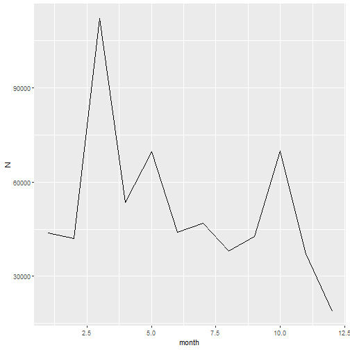

## R Markdown

This is an R Markdown document. Markdown is a simple formatting syntax for authoring HTML, PDF, and MS Word documents. For more details on using R Markdown see <http://rmarkdown.rstudio.com>.

When you click the **Knit** button a document will be generated that includes both content as well as the output of any embedded R code chunks within the document. You can embed an R code chunk like this:


```r
summary(cars)
```

```
##      speed           dist       
##  Min.   : 4.0   Min.   :  2.00  
##  1st Qu.:12.0   1st Qu.: 26.00  
##  Median :15.0   Median : 36.00  
##  Mean   :15.4   Mean   : 42.98  
##  3rd Qu.:19.0   3rd Qu.: 56.00  
##  Max.   :25.0   Max.   :120.00
```

## Including Plots

You can also embed plots, for example:


Note that the `echo = FALSE` parameter was added to the code chunk to prevent printing of the R code that generated the plot.


```r
Sys.Date()
```

```
## [1] "2020-02-19"
```

```r
  lubridate::minute(Sys.time())
```

```
## [1] 55
```

```r
  format(Sys.time(), '%d/%b/%Y:%H:%M:%S')
```

```
## [1] "19/Feb/2020:17:55:38"
```

```r
  format(Sys.time(), '%Y%m%d_%H%M%S')
```

```
## [1] "20200219_175538"
```


```r
library(data.table)
library(ggplot2)
library(tidyverse)
```

```
## -- Attaching packages ---------------------------------- tidyverse 1.2.1 --
```

```
## v tibble  2.1.3     v purrr   0.3.3
## v tidyr   1.0.0     v dplyr   0.8.3
## v readr   1.3.1     v stringr 1.4.0
## v tibble  2.1.3     v forcats 0.4.0
```

```
## -- Conflicts ------------------------------------- tidyverse_conflicts() --
## x dplyr::between()   masks data.table::between()
## x dplyr::filter()    masks stats::filter()
## x dplyr::first()     masks data.table::first()
## x dplyr::lag()       masks stats::lag()
## x dplyr::last()      masks data.table::last()
## x purrr::transpose() masks data.table::transpose()
```


```r
bikeshare.data = fread("../data/austin_bikeshare_trips.csv", 
                          header = TRUE, stringsAsFactors = FALSE) 
```


```r
bikeshare.data %>% 
  .[,.(.N), by = .(month)] %>% 
  na.omit() %>% 
  ggplot() + 
  geom_line(aes(month, N))
```




